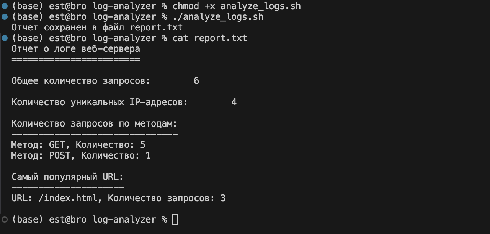

# Анализ логов

Этот репозиторий содержит Bash-скрипт, предназначенный для анализа логов доступа к серверу, извлекая ключевые метрики быстро и эффективно. Скрипт работает исключительно с Bash и стандартными утилитами Linux, обеспечивая портативность и минимальные зависимости.

## 🎯 Обзор задачи

Задача симулирует ситуацию, где необходимо анализировать серверные логи, имея только ограниченные инструменты (только Bash и утилиты Linux). Скрипт выполняет следующие действия:

1. Подсчитывает общее количество запросов.
2. Подсчитывает количество уникальных IP-адресов (с использованием `awk`).
3. Подсчитывает количество запросов по методам HTTP (например, GET, POST) с использованием `awk`.
4. Определяет самый популярный URL (с использованием `awk`).
5. Генерирует подробный отчет в виде текстового файла (`report.txt`).

## 📂 Файлы в репозитории

1. **access.log** - Пример файла логов, используемого для анализа.
2. **analyze_logs.sh** - Bash-скрипт, выполняющий анализ.
3. **report.txt** - Пример отчета, созданного скриптом `analyze_logs.sh`.
4. **result.png** - Скриншот, показывающий выполнение скрипта и проверку результата.

## ⚡ Функциональность скрипта

### Предварительные требования
- Среда на основе Linux с Bash.
- Дополнительные зависимости не требуются.

### Шаги, выполняемые скриптом
- **Общее количество запросов:** Подсчитывает все строки в `access.log`.
- **Уникальные IP:** Извлекает уникальные IP-адреса с помощью `awk`.
- **Запросы по методам:** Анализирует файл логов с помощью `awk`, чтобы подсчитать количество каждого метода HTTP.
- **Самый популярный URL:** Определяет наиболее часто запрашиваемый URL с помощью `awk`.
- **Генерация отчета:** Выводит результаты в файл `report.txt`.

## 📖 Инструкции по использованию

### Клонирование репозитория
```bash
git clone https://github.com/estbro/log-analyzer.git
cd log-analyzer
```

### Сделать скрипт исполняемым
```bash
chmod +x analyze_logs.sh
```

### Запуск скрипта
```bash
./analyze_logs.sh
```

### Вывод
- Скрипт создаст отчет в файле `report.txt`.
- Пример:
```plaintext
Отчет о логе веб-сервера
========================

Общее количество запросов:        6

Количество уникальных IP-адресов:        4

Количество запросов по методам:
-------------------------------
Метод: GET, Количество: 5
Метод: POST, Количество: 1

Самый популярный URL:
---------------------
URL: /index.html, Количество запросов: 3
```

## 🔍 Проверка результатов
Чтобы проверить результаты:
1. Запустите скрипт с предоставленным файлом `access.log`.
2. Сравните созданный файл `report.txt` с примером.
3. Ознакомьтесь с приложенным `result.png` для проверки.

## 📸 Пример выполнения
Ниже представлен скриншот выполнения скрипта:



## 📝 Лицензия
Этот проект выпущен под лицензией MIT.

